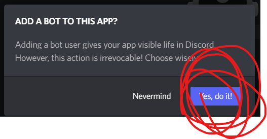

## **YOU MUST HAVE A COMPUTER**

#
#

# how to setup math bot?

do to [discord dev portal](https://discord.com/developers/applications) and make a bot it should look like this :

now give this application a name, this wont be the name of the bot in discord but it will be the name of the application.

now press the bot tab 
dont worry about the app info, it is not important.

new bot

make sure you say YES 

you should see this :

you can change the name and pfp (this is where it will look like in discord)

after your done press "reset token"

## DO NOT SHARE THIS TOKEN WITH ANYONE, PEOPLE CAN GET ACCESS TO YOUR BOT AND CONTROL IT.

copy it

now go open main.py (notepad is fine) and change the TOKEN to the one you copied.

and BOOM! you have a math bot. wellll, you need to invite it to a server.

go to the URL generator

then put in the checkmarks as below then copy the link and paste it in 
the url box in the browser

NOW you have the bot

# how to run it?

double click it or in the terminal type :
make sure your in the dir of the bot

    python3 main.py

    or 

    python3 src\main.py

after its running it will be in the background. of your computer

you can connect this bot to multiple servers with the same token.

